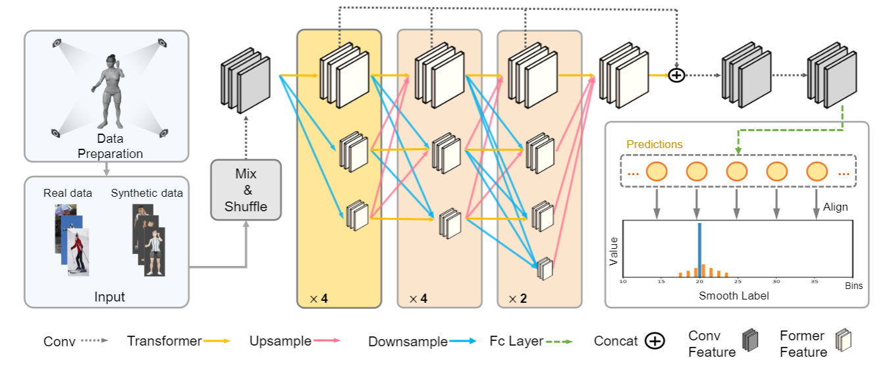
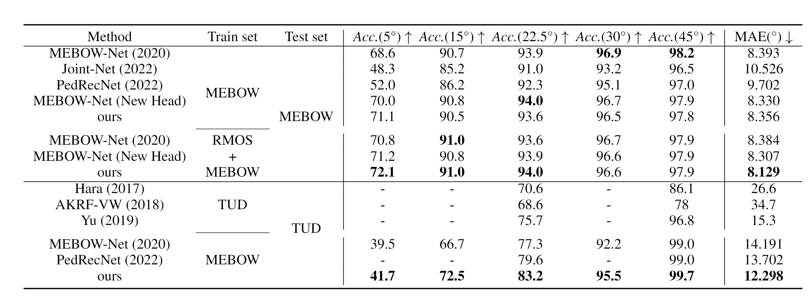
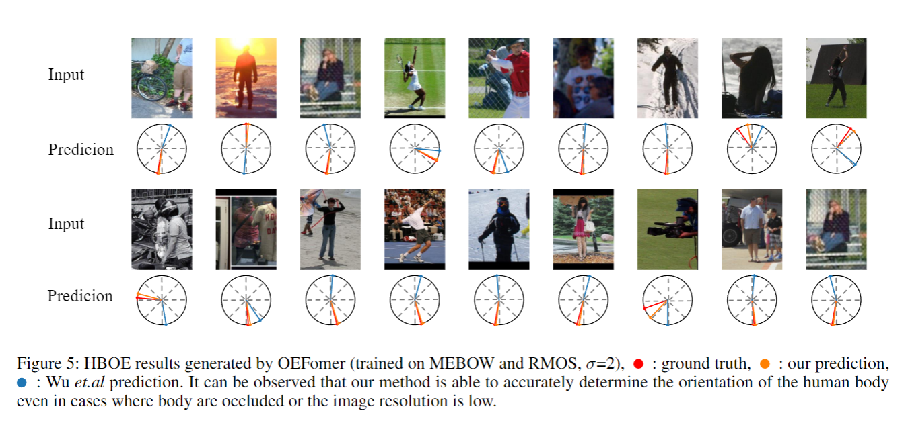
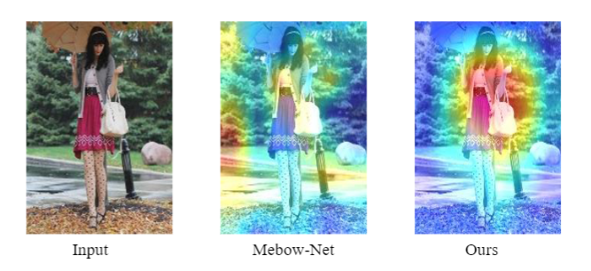

# AAAI2024 - Towards Fine-Grained HBOE with Rendered Orientation Set and Laplace Smoothing

**[Towards Fine-Grained HBOE with Rendered Orientation Set and Laplace Smoothing](https://ojs.aaai.org/index.php/AAAI/article/view/28582)**
<br/>
Ruisi Zhao, Mingming Li, Zheng Yang, Binbin Lin, Xiaohui Zhong, Xiaobo Ren, Deng Cai, Boxi Wu
<br/>

[](https://github.com/Whalesong-zrs/Towards-Fine-grained-HBOE)[](https://ojs.aaai.org/index.php/AAAI/article/view/28582)

Official codes for Towards Fine-Grained HBOE. This repository contains two version of implementation. 
1. Original version (Paper results, evaluation)
2. Optimized version (Less memory usage, simpler model. Please see the code for details, specifically in the model section, we design a new head with local-window attention. Compared to OEFormer, this version model significantly reduces training costs. We show the results in the following image.) 

## 🚩 Updates

- [√] Code Released.
- [√] Checkpoint Released.
- [√] Data Released.

## Method


## Highlights (Incorporate the results from our latest head design model)


## Results

### Visualize

------

### Heatmap



------


## Dependencies and Installation

- Python >= 3.9 (Recommend to use [Anaconda](https://www.anaconda.com/download/#linux) or [Miniconda](https://docs.conda.io/en/latest/miniconda.html))
- Please follow the environment.yml.

### Installation

1. Prepare environment

    ```bash
    conda create -n hboe python=3.9 -y
    conda activate hboe
    pip install -r requirements.txt
    ```


2. Clone repo & install

   ```bash
   git clone https://github.com/Whalesong-zrs/Towards-Fine-grained-HBOE.git
   cd towards-fine-grained-hboe
   ```


## ⏬ Pretrained Model and Data Preparation

### Pretrained Model Preparation

Download the checkpoints and put them in correct paths.

```bash
pretrained ckpt: 
pretrained_models/pretrained_hrnet.pth
pretrained_models/pretrained_oeformer.pth

trained ckpt:
checkpoints/hrnet_head.pth
checkpoints/oeformer.pth
```

### Paper Resources

If you want to quickly reimplement our methods, we provide the following resources used in the paper. For MEBOW dataset, please go to [MEBOW](https://github.com/ChenyanWu/MEBOW) for more details.

<table>
<tr>
    <th>Paper Resources</th>
    <td style="text-align: center;">Rendered Datasets</td>
    <td style="text-align: center;">Checkpoints</td>
</tr>
<tr>
    <th>Download Link</td>
    <td style="text-align: center;"><a href="https://drive.google.com/file/d/1-CXJyJeVq58ABJUcaqI7qbZ7xEAWKTb9/view?usp=sharing">Google Drive</a></td>
    <td style="text-align: center;"><a href="https://drive.google.com/file/d/1PSFX1U0rdZdpIaoR7np5UCn3jD8DjQWJ/view?usp=sharing">Google Drive</a></td>
</tr>
</table>


After downloading, the path should be arranged as follows:

```
towards-fine-grained-hboe
├── checkpoints
|   ├── hrnet_head.pth # Trained checkpoints
│   ├── oeformer.pth
├── experiments
|   ├── hrnet_head.yaml  # Training / Inference setting
|   ├── oeformer.yaml
├── imgs
├── lib
│   ├── config # Some scripts about config
│   ├── core # Train and enaluate
│   ├── dataset 
│   ├── utils 
├── logs
├── model_arch
├── output
├── pretrained_models
├── tools
...
```


## Training 
```bash
# check your config
bash train.sh
```

## Inference
```bash
# check your config
bash test.sh
```

## 📜 License and Acknowledgement

This codebase builds on [MEBOW](https://github.com/ChenyanWu/MEBOW). Thanks for open-sourcing! Besides, we acknowledge following great open-sourcing projects:
- mmcv (https://github.com/open-mmlab/mmcv).


## 🌏 Citation

```bibtex
@inproceedings{zhao2024towards,
  title={Towards Fine-Grained HBOE with Rendered Orientation Set and Laplace Smoothing},
  author={Zhao, Ruisi and Li, Mingming and Yang, Zheng and Lin, Binbin and Zhong, Xiaohui and Ren, Xiaobo and Cai, Deng and Wu, Boxi},
  booktitle={Proceedings of the AAAI Conference on Artificial Intelligence},
  volume={38},
  number={7},
  pages={7505--7513},
  year={2024}
}
```


## 📧 Contact

If you have any questions and improvement suggestions, please email Ruisi Zhao (zhaors00@zju.edu.cn), or open an issue.
